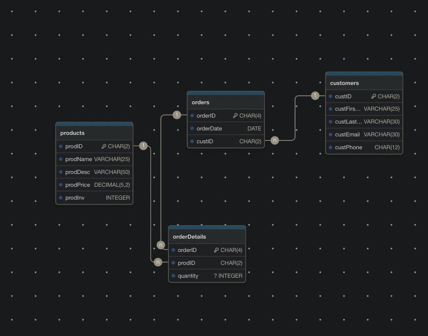
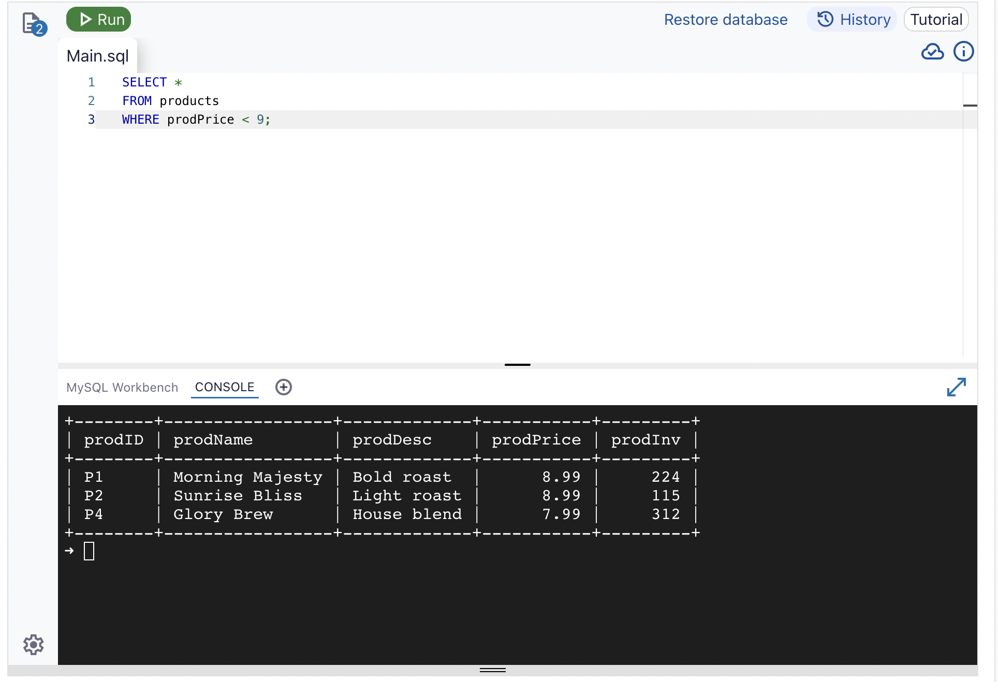
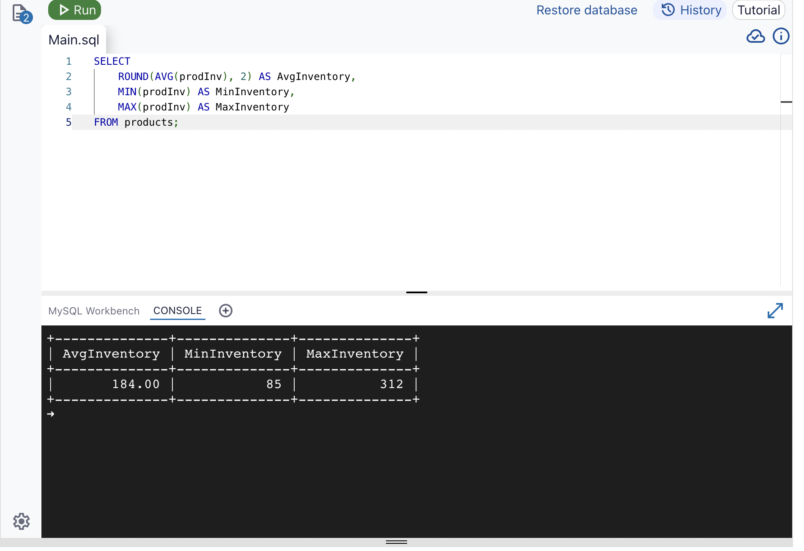
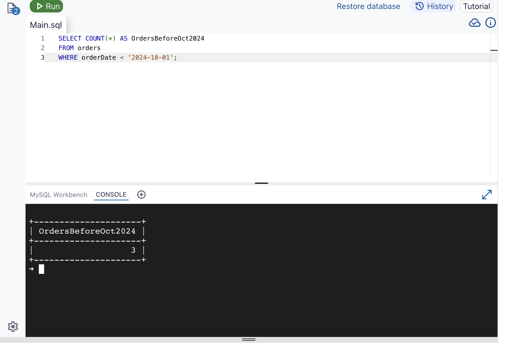
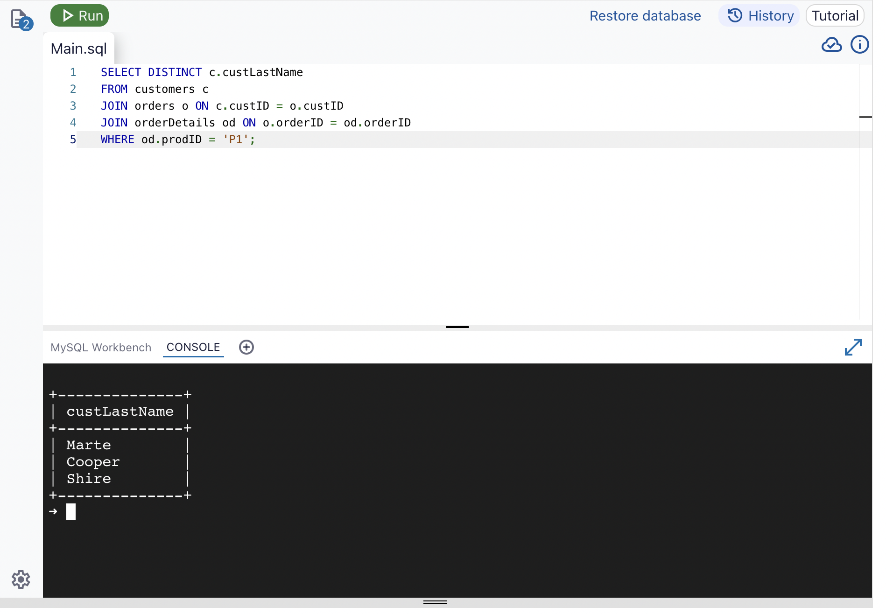
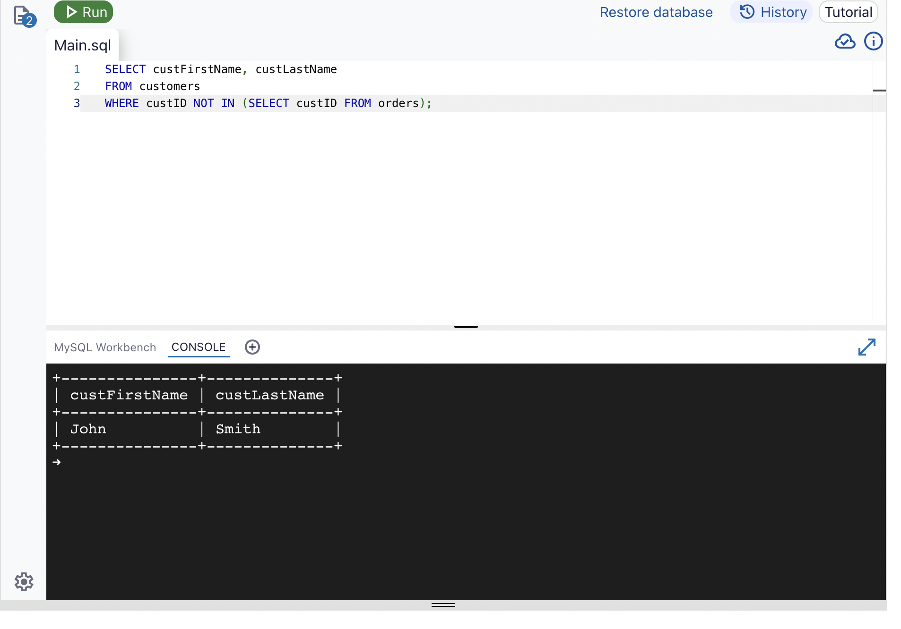

# Coffee Shop Database System

A relational database management system designed for a coffee shop business, developed as part of CEIS236 - Database Systems and Programming Fundamentals course at DeVry University.

## 📋 Project Overview

This project implements a normalized relational database for managing a coffee shop's products, customers, orders, and order details. The database follows proper normalization principles and includes foreign key constraints to maintain referential integrity.

## 🗄️ Database Schema

The database consists of four main tables:

### Products
Stores information about coffee products available for sale.
- `prodID` (CHAR(2)) - Primary Key
- `prodName` (VARCHAR(25)) - Product name
- `prodDesc` (VARCHAR(50)) - Product description
- `prodPrice` (DECIMAL(5,2)) - Product price
- `prodInv` (INT) - Current inventory count

### Customers
Maintains customer contact information.
- `custID` (CHAR(2)) - Primary Key
- `custFirstName` (VARCHAR(25)) - Customer's first name
- `custLastName` (VARCHAR(25)) - Customer's last name
- `custEmail` (VARCHAR(50)) - Email address
- `custPhone` (VARCHAR(15)) - Phone number

### Orders
Tracks order headers with customer relationships.
- `orderID` (CHAR(4)) - Primary Key
- `orderDate` (DATE) - Order date
- `custID` (CHAR(2)) - Foreign Key to Customers

### OrderDetails
Manages the many-to-many relationship between orders and products.
- `orderID` (CHAR(4)) - Foreign Key to Orders (Composite Primary Key)
- `prodID` (CHAR(2)) - Foreign Key to Products (Composite Primary Key)
- `quantity` (INT) - Quantity ordered

## 📊 Entity Relationship Diagram



The ERD shows the relationships between all four tables, with proper foreign key constraints maintaining data integrity.

## 🚀 Getting Started

### Prerequisites
- MySQL, PostgreSQL, or any SQL-compatible database management system
- SQL client or command-line interface

### Installation

1. Clone this repository:
```bash
git clone https://github.com/yourusername/Software-development-assignments.git
cd Software-development-assignments/CEIS236-Database-Project
```

2. Create the database schema:
```bash
mysql -u username -p < sql/01_schema.sql
```

3. Load sample data:
```bash
mysql -u username -p < sql/02_data.sql
```

4. Run analysis queries:
```bash
mysql -u username -p < sql/03_queries.sql
```

## 📝 Sample Queries

The project includes five analytical queries demonstrating various SQL concepts:

### Query 1: Products Under $9
Retrieves all products with prices below $9.00.



### Query 2: Inventory Statistics
Calculates average, minimum, and maximum inventory levels across all products.



### Query 3: Orders Before October 2024
Counts orders placed before October 1, 2024.



### Query 4: Customers Who Ordered "Morning Majesty"
Lists customers who have purchased product P1 (Morning Majesty).



### Query 5: Customers Without Orders
Identifies customers who have never placed an order.



## 📁 Project Structure

```
CEIS236-Database-Project/
├── sql/
│   ├── 01_schema.sql      # Database schema definition
│   ├── 02_data.sql        # Sample data insertion
│   └── 03_queries.sql     # Analysis queries
├── images/
│   ├── image1.png         # ERD diagram
│   ├── image2.png         # Query 3 results
│   ├── image3.png         # Query 5 results
│   ├── image4.png         # Query 2 results
│   ├── image5.png         # Query 1 results
│   └── image6.png         # Query 4 results
├── docs/
│   └── (Additional documentation)
└── README.md              # This file
```

## 🎓 Learning Objectives

This project demonstrates proficiency in:

- Database design and normalization
- Creating Entity Relationship Diagrams (ERD)
- Writing DDL (Data Definition Language) statements
- Writing DML (Data Manipulation Language) statements
- Implementing foreign key constraints
- Writing complex SQL queries with JOINs
- Using aggregate functions (COUNT, AVG, MIN, MAX)
- Implementing LEFT JOINs to find missing relationships

## 🔧 Technologies Used

- **SQL** - Structured Query Language for database operations
- **MySQL/PostgreSQL** - Relational Database Management System
- **DrawDB** - Entity Relationship Diagram creation

## 👤 Author

**Andres Marte**
- Course: CEIS236 - Database Systems and Programming Fundamentals
- Institution: DeVry University
- Date: November 2024

## 📄 License

This project is for educational purposes as part of coursework at DeVry University.

## 🙏 Acknowledgments

- DeVry University CEIS236 course materials
- DrawDB for ERD visualization
- SQL community and documentation

---

*This project was completed as the final project for CEIS236 - Database Systems and Programming Fundamentals at DeVry University.*
